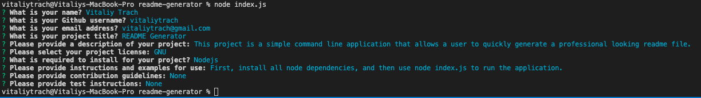

# Read Me Generator

## Description
This is a command-line application to make creating a professional readme file easier.
## Table of Contents
- [Installation](#installation)
- [Instructions](#instructions)
- [Credits](#credits)
- [License](#license)
## Installation
Nodejs dependecies
## Instructions
Just run the app using "node index.js" and follow the questions  

## Credits
Vitaliy Trach - [GitHub Profile](https://github.com/vitaliytrach)
## License
This product is licensed under the MIT license.
## How to Contribute
undefined
## Tests
N/A
## Questions
Email: vitaliytrach@gmail.com
GitHub: [vitaliytrach](https://github.com/vitaliytrach)
